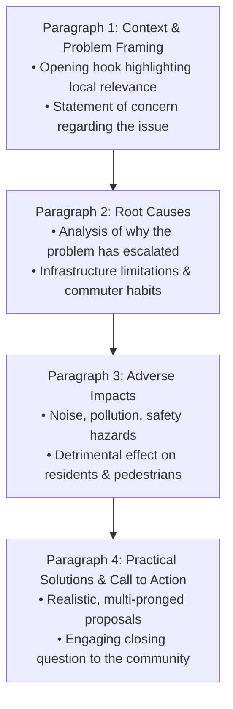

# Cambridge English Skills Test (General)
## Writing Mastery & Coaching Guide: Parts 1 & 2

This comprehensive guide is designed for coaching students to achieve **B2 to C1 level** performance on the Writing module of the Cambridge English Skills Test (General).

---

## 1. Exam Mechanics & Marking Architecture

* **Total Time**: 45 minutes (single shared timer for both tasks).
* **Suggested Time Allocation**: 15 minutes on Part 1 | 30 minutes on Part 2.
* **Scoring System**: Marked by the **Cambridge ALTA Automated Language Assessment Engine** (machine learning models trained on millions of certified human examiner-scored scripts).
* **Evaluation Criteria**:

| Dimension | What the AI Automarker Evaluates | Key Target for B2 / C1 |
| :--- | :--- | :--- |
| **Communicative Achievement** | Appropriate genre conventions, consistent register, reader engagement, answering all prompt prompts. | Demonstrates natural tone (informal for email, constructive civic voice for public post). Never leaves a bullet point unaddressed. |
| **Organisation** | Macro-structure (paragraphs), micro-structure (linking words, pronouns, cohesive devices). | Ideas flow seamlessly. Avoids the "bullet-point answer list" trap. Uses variety in discourse markers. |
| **Language: Range** | Sophistication of vocabulary, collocations, idiomatic phrasing, variety of sentence structures. | Uses less common lexis appropriately; incorporates compound, complex, conditional, and passive sentences. |
| **Language: Accuracy** | Grammatical control, word formation, spelling, and punctuation. | Occasional slips are permissible if meaning is completely unimpeded. Non-systematic slips do not block C1. |

---

## 2. PART 1: The Informal Email Blueprint

### Task Specification
* **Target Length**: At least 50 words (Optimal coach target: **80–110 words** to demonstrate range without risking time penalty).
* **Recommended Time**: ~15 minutes.
* **Genre**: Personal communication to a friend, colleague, or classmate.

### The Fail-Safe 5-Part Email Formula
1. **Friendly Salutation**: *"Hi Jan,"* / *"Dear Jan,"* (Always use a comma).
2. **Engaging Opening & Reconnection**: Acknowledge the news or elapsed time with genuine emotion (*"It was fantastic to hear from you — I can't believe it's been five years already!"*).
3. **Point 1 (Suggestion)**: Suggest an activity with rationale (*"How about booking a private room at that Italian restaurant near campus where we used to hang out?"*).
4. **Point 2 (Timing)**: Propose a specific time and justify it (*"Mid-November would probably suit everyone best, as it falls right before the holiday rush."*).
5. **Point 3 (Offer to Help) & Call to Action**: Propose concrete assistance and sign off (*"I'd be more than happy to set up a group chat to coordinate bookings. Let me know what you think! Best, Alex"*)

---

### Official Sample Prompt 1: College Reunion
> **Prompt**: You have received an email from Jan, a friend from college:  
> *"Do you know it will soon be five years since we finished college? I think we should contact our old friends and arrange to meet again. Have you got any ideas about what we could do to celebrate and when? Write and tell me."*  
> **Write an email to Jan**:  
> • suggest a good way to celebrate with your old college friends  
> • explain when the best time for the celebration would be  
> • offer to help organise the celebration  
> *Write at least 50 words.*

#### Model Response: Band C1 (Exemplary | ~105 words)
```markdown
Hi Jan,

What a wonderful surprise to hear from you! It’s incredible how quickly those five years have flown by.

I love the idea of a reunion. How about organizing an informal weekend dinner at a lively bistro in town, followed by drinks? That would give us plenty of space to catch up without feeling rushed. Early next month would probably work best for everyone, particularly the second weekend before people's schedules fill up for the holidays. 

If you'd like, I could reach out to the others and set up an event group to track who can make it. 

Can't wait to see everyone!

Warmly,
Alex
```
* **Why this achieves C1**:
  * *Communicative Achievement*: Natural conversational warmth, empathetic reflection on time passing, seamless integration of all 3 required points.
  * *Organisation*: Divided into logical paragraph blocks; smooth cohesion (*"I love the idea... That would give us... If you'd like..."*).
  * *Language*: Idiomatic vocabulary (*flown by, catch up without feeling rushed, schedules fill up*); diverse structures (exclamative, gerund subject, conditional *if you'd like, I could*).

#### Model Response: Band B2 (Solid & Secure | ~85 words)
```markdown
Hi Jan,

It’s great to hear from you! I agree that we definitely need to celebrate our five-year anniversary. 

Why don’t we organize a dinner party in a nice restaurant in the city center? That way, we can talk and remember our college days together. I think the end of next month would be the ideal time, as most people will be free on a Saturday evening. 

I’d be very happy to help you contact our old classmates and book the venue. 

Let me know what you think!

Best wishes,
Sam
```

---

## 3. PART 2: The Public Civic Post Blueprint

### Task Specification
* **Target Length**: At least 180 words (Optimal coach target: **200–240 words**).
* **Recommended Time**: ~30 minutes.
* **Genre**: Public contribution to an online forum, community website, or local council board.
* **Tone**: Constructive, civic-minded, persuasive, and analytical.

### The 4-Paragraph Problem-Cause-Solution Architecture



---

### Official Sample Prompt 2: Town Traffic Congestion
> **Prompt**: The town where you live has a website where local people can discuss local issues. You are concerned about the increase in car and truck traffic in the town and have decided to post your comments on the town website.  
> **Write your comments for the town website about**:  
> • why you think the amount of traffic is increasing in your town  
> • what problems the increased traffic is causing in your town  
> • how the amount of traffic in your town could be reduced  
> *You can also include any other points you think are important. Write at least 180 words.*

#### Model Response: Band C1 (Exemplary | ~225 words)
```markdown
Over the past couple of years, the dramatic surge in traffic across our town has become an issue that none of us can afford to overlook. Having lived here for over a decade, I feel compelled to share my concerns and propose constructive steps forward.

The root cause of this congestion appears to be two-fold: rapid residential expansion without corresponding road upgrades, coupled with commercial haulage trucks using our historic town center as a shortcut to bypass highway tolls. Because our public transit network remains infrequent and costly, residents have little alternative but to rely on private vehicles for daily errands.

Consequently, this influx of heavy vehicles is severely eroding our quality of life. The resulting air and noise pollution make walking along Main Street thoroughly unpleasant, while morning bottlenecks create hazardous conditions for schoolchildren attempting to cross narrow intersections. Furthermore, structural vibrations from heavy lorries threaten our town's older heritage buildings.

To tackle this unsustainable situation, local authorities should implement a comprehensive transport strategy. First and foremost, heavy transit vehicles ought to be banned from residential streets through weight-limit restrictions, redirecting them onto the outer ring road. Simultaneously, subsidizing electric bus fares and expanding dedicated cycle corridors would incentivize commuters to leave their cars at home. 

What are your thoughts on introducing designated pedestrian zones downtown?
```

* **Why this achieves C1**:
  * *Communicative Achievement*: Authoritative yet civic-minded voice; fully develops all 3 core bullet points plus an additional relevant observation (heritage building damage).
  * *Organisation*: Impeccable 4-stage progression with sophisticated signposting (*"The root cause... Consequently, this influx... To tackle this unsustainable situation... First and foremost..."*).
  * *Language*: Rich academic and topical collocations (*residential expansion, commercial haulage, public transit network, hazardous conditions, structural vibrations, comprehensive transport strategy, dedicated cycle corridors*); complex structures (participial clauses, passive modals *ought to be banned*).

#### Model Response: Band B2 (Solid & Clear | ~195 words)
```markdown
I am writing to share my views on the growing traffic problem that is affecting everyone in our town. Over recent months, the congestion has become significantly worse, and it is time we took action.

There are several reasons for this increase. Firstly, many new residential complexes have been constructed nearby, bringing hundreds of new cars into the area. Secondly, many delivery trucks pass through our narrow streets because there are no clear restrictions. Because our bus service is often late, people naturally prefer to drive.

This excessive traffic causes serious issues for local residents. Air pollution has risen noticeably, and the constant noise makes it difficult to enjoy our neighborhoods. In addition, roads are no longer safe for cyclists and children walking to school. 

To improve the situation, the local council must take immediate action. Heavy trucks should be prohibited from entering center streets during peak hours, and delivery schedules should be restricted to early mornings. Furthermore, improving bus frequency and lowering ticket prices would encourage people to use public transport.

I would encourage everyone in the community to support these proposals so we can make our town safer and cleaner.
```

---

## 4. High-Scoring Vocabulary & Phrase Bank

### A. Discourse Connectors (Signposting)
* **Introducing Causes**: *One primary driver of this trend is... | This surge can largely be attributed to... | A contributing factor is the lack of...*
* **Describing Consequences**: *Consequently, ... | As an immediate repercussion, ... | This in turn compromises... | This has placed an intolerable strain on...*
* **Proposing Solutions**: *A viable countermeasure would be to... | Authorities ought to prioritize... | This issue could be mitigated by... | It is imperative that we implement...*

### B. Topical Collocations (General & Civic Issues)
* *Urban living*: residential developments, urban sprawl, pedestrianized zones, quality of life, heritage architecture.
* *Transportation*: commuter flow, public transit infrastructure, dedicated cycle paths, heavy goods vehicles, traffic bottlenecks, carbon emissions.
* *Community proposals*: municipal council, feasibility study, civic engagement, long-term sustainability, targeted subsidies.

---

## 5. Coaching Diagnostic Checklist

Use this 6-point checklist to evaluate and give feedback on your student's practice essays in under 2 minutes:

- [ ] **1. Task Fulfillment**: Did the student cover all 3 bullet points from the prompt? *(Missing even one bullet caps the Communicative Achievement score at B1).*
- [ ] **2. Word Count Threshold**: Is Part 1 $\ge 50$ words and Part 2 $\ge 180$ words?
- [ ] **3. Visual Paragraphing**: Is the essay visibly blocked into distinct paragraphs with blank lines between them? *(The ALTA automarker rewards clear discourse division).*
- [ ] **4. Tone & Register**: Does Part 1 read like a warm, personal email and Part 2 like a constructive public civic forum post?
- [ ] **5. Syntactic Variety**: Did the student use at least two complex sentences (e.g., *Although..., If..., Not only... but also...*)?
- [ ] **6. Vocabulary Precision**: Are there specific, vivid words instead of repeated generic terms (*problem $\rightarrow$ bottleneck/nuisance/challenge*; *bad $\rightarrow$ hazardous/disruptive*)?
